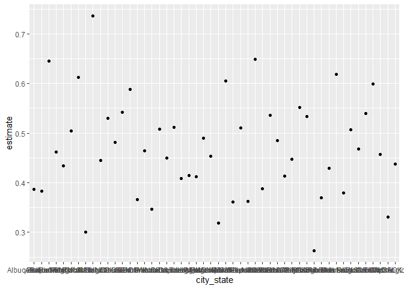
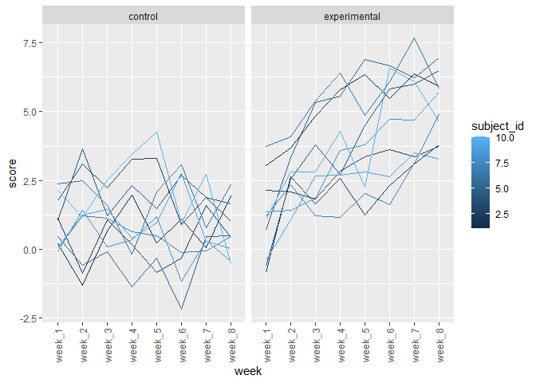

p8105\_hw5\_br2598
================
Brandon Rojas
11/15/2021

``` r
# homicide_df <- read_csv("./data-homicides-master/homicide-data.csv") %>%
#   janitor::clean_names()
```

``` r
# homicide_df <- homicide_df %>%
#   mutate(city_state = str_c(city,", ", state))
# 
# city_summary <- homicide_df %>% 
#   group_by(city_state,disposition) %>% 
#   summarize(homicides = n())
# 
# dis_summary <- city_summary %>%
#   group_by(homicides, disposition) %>%
#   summarize(case_status = n())
# 
# #sum(filter(city_summary, disposition == "Open/No arrest"))
# 
# 
# 
# 
# # city_summary <- homicide_df %>%
# #   group_by(city_state) %>%
# #   summarize(num_homicides = n(), unsolved = round(count(filter(homicide_df, disposition == "Open/No arrest"))) )
#   
# city_summary
```

Jeff

``` r
homicide_df <- read_csv("./data-homicides-master/homicide-data.csv", na = c("", "Unknown")) %>%
  mutate(
    city_state = str_c(city, state),
    resolution = case_when(
      disposition == "Closed without arrest" ~ "unsolved",
      disposition == "Open/No arrest"        ~ "unsolved",
      disposition == "Closed by arrest"      ~ "solved"
    )) %>%
  relocate(city_state) %>% filter(city_state != "TulsaAL") 
```

    ## Rows: 52179 Columns: 12

    ## -- Column specification --------------------------------------------------------
    ## Delimiter: ","
    ## chr (8): uid, victim_last, victim_first, victim_race, victim_sex, city, stat...
    ## dbl (4): reported_date, victim_age, lat, lon

    ## 
    ## i Use `spec()` to retrieve the full column specification for this data.
    ## i Specify the column types or set `show_col_types = FALSE` to quiet this message.

Jeff - Focusing on Baltimore

``` r
baltimore_df <- 
  homicide_df %>%
  filter(city_state == "BaltimoreMD")

baltimore_summary =
  baltimore_df %>%
  summarize(
    unsolved = sum(resolution == "unsolved"),
    n = n()
  )

baltimore_test =
  prop.test(x = baltimore_summary %>%  pull(unsolved),
          n = baltimore_summary %>% pull(n))

baltimore_test %>%
  broom::tidy()
```

    ## # A tibble: 1 x 8
    ##   estimate statistic  p.value parameter conf.low conf.high method    alternative
    ##      <dbl>     <dbl>    <dbl>     <int>    <dbl>     <dbl> <chr>     <chr>      
    ## 1    0.646      239. 6.46e-54         1    0.628     0.663 1-sample~ two.sided

Jeff - Iterating the above solution

``` r
prop_test_function = function(city_df){
    city_summary =
    city_df %>%
    summarize(
      unsolved = sum(resolution == "unsolved"),
      n = n()
  )
    
  city_test =
  prop.test(x = city_summary %>%  pull(unsolved),
          n = city_summary %>% pull(n))
  
  return(city_test)
}


homicide_df %>% filter(city_state == "AlbuquerqueNM") %>%
  prop_test_function() 
```

    ## 
    ##  1-sample proportions test with continuity correction
    ## 
    ## data:  city_summary %>% pull(unsolved) out of city_summary %>% pull(n), null probability 0.5
    ## X-squared = 19.114, df = 1, p-value = 1.232e-05
    ## alternative hypothesis: true p is not equal to 0.5
    ## 95 percent confidence interval:
    ##  0.3372604 0.4375766
    ## sample estimates:
    ##         p 
    ## 0.3862434

Iterating across all cities

``` r
results_df =
  homicide_df %>%
  nest(data = uid:resolution) %>%
  mutate(
    test_results = map(data, prop_test_function),
    tidy_results = map(test_results, broom::tidy)
  ) %>% select(city_state, tidy_results) %>%
  unnest(tidy_results) %>%
  select(city_state, estimate, starts_with("conf"))

results_df
```

    ## # A tibble: 50 x 4
    ##    city_state    estimate conf.low conf.high
    ##    <chr>            <dbl>    <dbl>     <dbl>
    ##  1 AlbuquerqueNM    0.386    0.337     0.438
    ##  2 AtlantaGA        0.383    0.353     0.415
    ##  3 BaltimoreMD      0.646    0.628     0.663
    ##  4 Baton RougeLA    0.462    0.414     0.511
    ##  5 BirminghamAL     0.434    0.399     0.469
    ##  6 BostonMA         0.505    0.465     0.545
    ##  7 BuffaloNY        0.612    0.569     0.654
    ##  8 CharlotteNC      0.300    0.266     0.336
    ##  9 ChicagoIL        0.736    0.724     0.747
    ## 10 CincinnatiOH     0.445    0.408     0.483
    ## # ... with 40 more rows

``` r
#
# nested_df %>%
#   filter(city_state == "BaltimoreMD") %>%
#   pull(test_results) #same results as using single prop test but using the map function
```

## Problem 1

-   Describe the raw data.

The following data describes 52178 homicides from 2007 to 2015, in 50
large U.S. cities in 28 states, compiled by the Washington Post in 2018.
The records also contain the outcome of each homicide, and whether an
arrest was made on behalf of the victim. At time of compilation, 45% of
the cases were closed with an arrest.

-   Create a city\_state variable (e.g. “Baltimore, MD”) and then
    summarize within cities to obtain the total number of homicides and
    the number of unsolved homicides (those for which the disposition is
    “Closed without arrest” or “Open/No arrest”).

There are 23583 cases that are open with no arrest, 25673

Jeff - Plot

``` r
 results_df %>%
   ggplot(aes(x = city_state, y = estimate)) +
   geom_point() #no factoring
```

<!-- -->

``` r
#yes factoring
results_df %>%
  mutate(city_state = fct_reorder(city_state, estimate)) %>% #turn city state into a factor ordered by estimate value 
  ggplot(aes(x = city_state, y = estimate)) +
  geom_point()+
  geom_errorbar(aes(ymin = conf.low, ymax = conf.high)) +
  theme(axis.text.x = element_text(angle = 90, vjust = 0.5, hjust = 1))
```

<!-- -->

## Problem 2

Start with a dataframe containing all file names; the list.files
function will help Iterate over file names and read in data for each
subject using purrr::map and saving the result as a new variable in the
dataframe

``` r
data_path <- "./hw5_data/data"

control_files = tibble(
  list.files(path = data_path, pattern = "con_")) 

experimental_files = tibble(
  list.files(path = data_path, pattern = "exp_")) 

control_df <- control_files %>%
  map(~ read_csv(file.path(data_path, .))) %>% 
  reduce(rbind) %>% mutate(
    control_arm = str_c("control"),
    subject_id = seq.int(nrow(control_files))) %>%
  pivot_longer(
  week_1:week_8,    
  names_to = "week",
  values_to = "score"
    )
```

    ## Rows: 10 Columns: 8

    ## -- Column specification --------------------------------------------------------
    ## Delimiter: ","
    ## dbl (8): week_1, week_2, week_3, week_4, week_5, week_6, week_7, week_8

    ## 
    ## i Use `spec()` to retrieve the full column specification for this data.
    ## i Specify the column types or set `show_col_types = FALSE` to quiet this message.

``` r
experimental_df <- experimental_files %>%
  map(~ read_csv(file.path(data_path, .))) %>% 
  reduce(rbind) %>% mutate(
    control_arm = str_c("experimental"),
    subject_id = seq.int(nrow(experimental_files))) %>% 
  pivot_longer(
  week_1:week_8,    
  names_to = "week",
  values_to = "score"
    )
```

    ## Rows: 10 Columns: 8

    ## -- Column specification --------------------------------------------------------
    ## Delimiter: ","
    ## dbl (8): week_1, week_2, week_3, week_4, week_5, week_6, week_7, week_8

    ## 
    ## i Use `spec()` to retrieve the full column specification for this data.
    ## i Specify the column types or set `show_col_types = FALSE` to quiet this message.

``` r
merge_df = rbind(experimental_df, control_df)

p <- merge_df %>% ggplot(aes(x = week, y = score, group = subject_id, color = subject_id)) +  facet_grid(. ~ control_arm) + geom_line() + 
  theme(axis.text.x = element_text(angle = 90, vjust = 0.5, hjust = 1))
p
```

<!-- -->

Two subjects in the experimental group have higher scores, from the
first week onwards, than anyone at any point in the control group. The
experimental group as a whole trends towards higher scores.

There appears to be slightly greater variance in the initial scores of
the experimental group.

## Problem 3

The code chunk below loads the iris dataset from the tidyverse package
and introduces some missing values in each column. The purpose of this
problem is to fill in those missing values.

There are two cases to address:

-   For numeric variables, you should fill in missing values with the
    mean of non-missing values
-   For character variables, you should fill in missing values with
    “virginica”

Write a function that takes a vector as an argument; replaces missing
values using the rules defined above; and returns the resulting vector.
Apply this function to the columns of iris\_with\_missing using a map
statement

``` r
set.seed(10)

iris_with_missing = iris %>% 
  map_df(~replace(.x, sample(1:150, 20), NA)) %>%
  mutate(Species = as.character(Species)) 

iris_impute_function = 
  function(x){
    
  if (is.numeric(x)) {
    na.aggregate(x)
  } 
    else if (is.character(x)){
    replace_na(x,'virginica')
  }
    
  }

# iris_impute = function(x) {
#   if (is.numeric(x)) {
#     any NA in that column is replaced with the mean
#   } 
#   if (is.character(x)){
#   any NA in that column is replaced with "virginica"
#   }

impute_iris = map(iris_with_missing, iris_impute_function)
```
